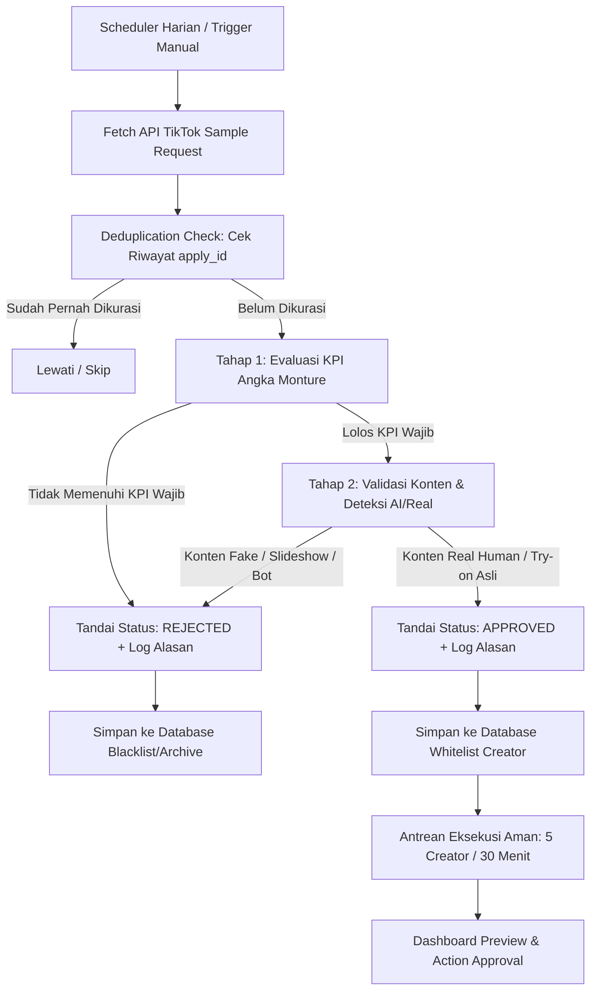

# Product Requirements Document (PRD)
# Monture Affiliate Sample Curation & Quality Gate Engine

| Dokumen | Keterangan |
| :--- | :--- |
| **Nama Produk** | Monture TikTok Affiliate Sample Curation Engine |
| **Brand** | Monture (Pakaian Pria, Rompi Puffer, Jaket & Luaran, Outdoor) |
| **Versi Dokumen** | 1.0.0 |
| **Status** | Approved for Development |
| **Target Integrasi** | API TikTok Shop / Tokopedia Affiliate (`affiliate-id.tokopedia.com`) |

---

## 1. Pendahuluan

### 1.1 Latar Belakang
Program *Free Sample* (sampel gratis) di TikTok Shop Affiliate merupakan saluran akuisisi pemasaran yang sangat efektif namun memiliki risiko biaya operasional (HPP) yang tinggi jika tidak terkontrol. 

Saat ini, toko Monture menerima puluhan hingga ratusan permohonan sampel setiap minggunya. Proses kurasi manual yang dilakukan melalui aplikasi TikTok Seller menghadapi kendala:
1. **Pemborosan Biaya HPP Produk**: Mengirimkan produk bernilai tinggi (rompi puffer/jaket dengan HPP signifikan) ke creator dengan *fulfillment rate* 0% atau akun yang tidak pernah mengunggah video sampel.
2. **Ketidaksesuaian Niche**: Banyak creator dari kategori yang sama sekali tidak relevan (seperti suku cadang otomotif, alat bengkel, perlengkapan bayi) yang meminta sampel pakaian pria.
3. **Maraknya Akun Bot & Konten AI/Reupload**: Maraknya akun affiliator yang hanya mengunggah *slideshow* foto katalog statis atau video avatar buatan AI tanpa pernah mencoba produk secara fisik (*try-on*), sehingga konversi penjualannya sangat rendah.
4. **Proses Kurasi Manual yang Lambat**: Mengecek puluhan profil satu per satu di layar ponsel memakan waktu berjam-jam dan rentan subjektif.

### 1.2 Tujuan
Membangun sebuah sistem otomasi pintar (**Curation & Quality Gate Engine**) yang:
1. Menarik seluruh data permohonan sampel creator secara berkala dari API TikTok Shop Affiliate.
2. Menyaring calon affiliator secara objektif menggunakan parameter **7 KPI Brand Monture**.
3. Memastikan keaslian konten (*Real Creator Try-on* vs *AI/Bot Slideshow*).
4. Menyimpan histori alasan kelayakan (*audit trail*) serta mengelompokkan creator ke dalam status yang jelas (`APPROVED`, `REJECTED`, `PENDING`).
5. Mencegah deteksi bot oleh sistem TikTok melalui mekanisme interval eksekusi yang aman (*throttling & jitter*).

### 1.3 Target Pengguna
- **Brand Owner & Marketing Director**: Memantau efektivitas budget alokasi sampel dan ROI affiliate.
- **Affiliate Marketing Specialist / Admin Toko**: Mengelola antrean permohonan sampel tanpa harus membuka aplikasi HP satu per satu.

---

## 2. Alur Kerja Sistem (System Architecture & Workflow)

---

## 3. Spesifikasi Aturan Kurasi (Monture Brand KPI Rules)

Setiap creator yang masuk dievaluasi berdasarkan **7 Standar KPI Monture**:

### 3.1 Ringkasan Aturan KPI
| No | Parameter KPI | Kategori | Kriteria Lolos | Pemetaan Field API |
| :---: | :--- | :---: | :--- | :--- |
| **1** | **Jenis Konten** | **WAJIB** | Aktif membuat konten dalam bentuk Video TikTok (VT). Bukan sekadar penonton atau akun kosong. | `ec_top_video_data.length > 0` |
| **2** | **Level Affiliate** | **WAJIB** | • **Minimal Level 2, 3, 4, 5, atau 6**. • *Jika di bawah Level 2 (Opsional)*: Wajib memiliki **Produk Terjual > 1.000 pcs** dan **GMV rata-rata pembeli > Rp100.000**. | `creator_info.ecom_level` `creator_info.item_sold` `creator_info.gmv` |
| **3** | **Tren Penjualan** | **OPSIONAL** | Memiliki tren penjualan yang stabil atau meningkat. *(Tidak menggugurkan jika KPI Wajib lain terpenuhi)*. | Analisis performa omzet berkala |
| **4** | **Total Omzet (GMV)** | **OPSIONAL** | Total GMV creator **> Rp30.000.000**. Creator yang memenuhi syarat ini mendapatkan label **Prioritas Utama (Star Affiliate)**. | `creator_info.gmv` |
| **5** | **Kategori Produk** | **WAJIB** | Niche creator relevan dengan produk Monture: 1. *Pakaian Pria (Menswear & Underwear)* 2. *Jaket & Luaran (Outerwear)* 3. *Olahraga & Outdoor (Sports & Outdoor)* | `creator_info.categories` `video_products.name` |
| **6** | **Performa Video** | **WAJIB** | Memiliki tayangan video minimal **500+ views** (rata-rata tayangan atau video unggulan). | `creator_info.content_video_views >= 500` atau `max(play_cnt) >= 500` |
| **7** | **Konsistensi Konten** | **WAJIB** | Menggunakan **Solusi 1 (Proksi Cerdas 30 Hari)**: • Memiliki postingan video dalam 30 hari terakhir (`release_date`). • Memiliki **Fulfillment Rate >= 80%**. • Memiliki **Ecom Level >= 2**. | `ec_top_video_data[].release_date` `creator_info.fulfillment_rate` `creator_info.ecom_level` |

---

## 4. Spesifikasi Deteksi Kualitas Konten (Real Human vs AI/Bot)

Setelah creator lolos verifikasi data angka (Tahap 1), sistem melakukan verifikasi keaslian konten melalui sampel video (`ec_top_video_data`):

### 4.1 Indikator Konten ASLI (Real Human Creator) - *High Quality*
- **Try-on / Fitting Nyata**: Terlihat orang fisik yang mencoba langsung pakaian, memperlihatkan bahan puffer, jahitan, atau resleting.
- **Lingkungan Asli**: Latar belakang ruangan kamar, kantor, studio, jalanan, atau alam outdoor yang nyata.
- **Audio & Suara Asli**: Narasi suara manusia alami atau percakapan langsung dengan kamera.
- **Komentar Relevan**: Adanya interaksi tanya-jawab ukuran produk (*"Tinggi 175 BB 70 cocok pakai size apa?"*).

### 4.2 Indikator Konten FAKE / Hasil Generate AI / Reupload - *Disqualified*
- **Slideshow Gambar Bergerak**: Hanya kompilasi foto katalog atau flyer toko yang digeser dengan efek CapCut dan musik tanpa ada orang yang memegang produk.
- **Avatar Sintetis AI (Deepfake/HeyGen/D-ID)**: Model animasi dengan gerakan mulut kaku, kedipan mata tidak alami, dan tekstur kulit plastik.
- **Reupload Video Luar Negeri**: Mengambil video model luar negeri yang tidak sesuai dengan produk fisik lokal Monture.
- **Full Text-to-Speech (TTS Robot)**: Narasi 100% suara robot template tanpa modifikasi.

---

## 5. Fitur Keamanan Sistem & Anti-Detection Mechanism

Untuk memastikan akun toko Monture tidak terkena sanksi atau pembatasan dari TikTok Seller:

1. **Throttling & Batching Process**:
   - Kurasi atau aksi sistem dibatasi maksimal **5 creator per interval 30 menit**.
2. **Random Delay (Human-like Jitter)**:
   - Setiap interaksi atau request diberi jeda waktu acak antara 15 hingga 45 detik agar polanya menyerupai manusia yang sedang memeriksa dashboard.
3. **Aturan Deduplikasi (Idempotensi)**:
   - Sistem wajib mencatat `apply_id` dan `creator_id` yang telah diproses.
   - Creator yang sudah pernah memiliki status `APPROVED` atau `REJECTED` **tidak boleh diproses ulang** untuk permohonan yang sama.
4. **Credential & Cookie Vault**:
   - Sesi token TikTok (`msToken`, `X-Bogus`, `cookie`) disimpan dalam konfigurasi yang aman dengan indikator status masa aktif (*Active / Expired Notification*).

---

## 6. Persyaratan Fungsional (Functional Requirements)

### 6.1 Modul 1: Ingestion & Daily Scheduler
- Sistem menjalankan penarikan data harian otomatis (misal: pukul 07.00 WIB) untuk mengambil daftar permohonan sampel berstatus *Pending Review* (`tab: 10`).
- Sistem menangani paginasi otomatis (`cur_page`) hingga seluruh data permohonan baru selesai ditarik.

### 6.2 Modul 2: Rule Evaluator & Reasoning Generator
- Sistem menjalankan validasi 7 KPI Monture secara otomatis.
- Sistem mencatat string narasi **"Alasan Keputusan" (Reasoning Log)** untuk setiap creator:
  - *Contoh Lolos*: `"LOLOS: Level 3, Kategori Menswear & Underwear, Views rata-rata 626, Fulfillment Rate 100%, Video terverifikasi real try-on"`.
  - *Contoh Gugur*: `"DITOLAK: Kategori tidak sesuai (Automotive & Tools), views di bawah standar"`.

### 6.3 Modul 3: Lifecycle & Status Management
Setiap record disimpan dengan struktur status:
- `PENDING`: Permohonan baru yang belum dievaluasi.
- `APPROVED`: Memenuhi 100% KPI Wajib + Konten Asli.
- `REJECTED`: Gagal pada salah satu KPI Wajib atau terindikasi Bot/AI.
- `ACTION_EXECUTED`: Persetujuan/penolakan telah dieksekusi ke platform TikTok.

### 6.4 Modul 4: User Interface (UI) Dashboard Integration
Dashboard Marketing Monture menyediakan tampilan khusus **Affiliate Sample Quality Gate**:
1. **Ringkasan KPI Card**:
   - Total Permohonan Masuk
   - Total Creator Lolos Rekomendasi
   - Total Creator Ditolak Otomatis
   - Estimasi Budget Sampel yang Berhasil Diselamatkan (Rp Saved)
2. **Tabel Antrean Creator**:
   - Kolom: Creator Info, Level Badge, GMV, Views, Kategori, Status AI Audit, Alasan Rekomendasi, Aksi.
3. **Modal Video Player**:
   - Mengklik thumbnail akan memutar langsung video MP4 creator di dalam dashboard untuk verifikasi cepat oleh tim marketing.

---

## 7. Rencana Rilis & Roadmap Pengembangan

- **Fase 1 (Core Engine & Data Filter)**:
  - Integrasi API Fetcher dan penyimpanan lokal data pengajuan sampel.
  - Implementasi logika evaluasi 7 KPI Monture (Filter Tahap 1).
  - Mekanisme deduplikasi dan pencatatan alasan (*reasoning log*).
- **Fase 2 (UI Dashboard & Video Player)**:
  - Pembuatan antarmuka visual di Dashboard Marketing Monture.
  - Integrasi modal pemutar video MP4 langsung dan filter status (`APPROVED`, `REJECTED`).
- **Fase 3 (Audit Keaslian AI & Throttled Executor)**:
  - Penerapan deteksi konten Real vs AI.
  - Pengaktifan scheduler antrean eksekusi (5 creator / 30 menit).
